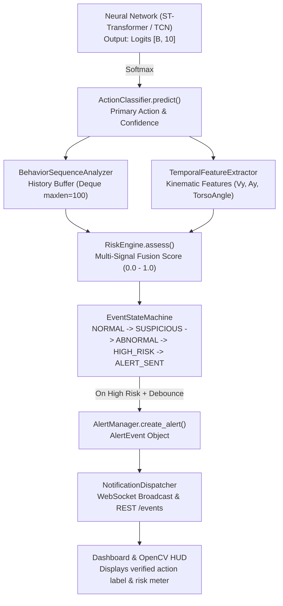

# Behavior Class Contract Audit

## 1. Executive Summary
This document establishes the verified, non-assumed contract for human action and behavior classes across the entire pipeline: from Neural Network output logits to Feature Extractors, State Machines, WebSockets, and UI Overlays.

## 2. Verified Class Registry

| Class ID | Class Name | Source File | Model Output Index | Expected Meaning | Severity Weight | Training Label Exists | Evaluation Data Exists |
|:---|:---|:---|:---|:---|:---|:---|:---|
| **0** | `walking` | `src/action/action_classifier.py` | 0 | Normal upright bipedal ambulation | 0.00 | Synthetic generator | Synthetic suite |
| **1** | `standing` | `src/action/action_classifier.py` | 1 | Stationary upright posture | 0.00 | Synthetic generator | Synthetic suite |
| **2** | `sitting` | `src/action/action_classifier.py` | 2 | Supported posture on chair/sofa | 0.00 | Synthetic generator | Synthetic suite |
| **3** | `lying` | `src/action/action_classifier.py` | 3 | Horizontal posture on bed/floor | 0.20 | Synthetic generator | Synthetic suite |
| **4** | `bending` | `src/action/action_classifier.py` | 4 | Torso flexion to pick up items (<2.5s) | 0.15 | Synthetic generator | Synthetic suite |
| **5** | `falling` | `src/action/action_classifier.py` | 5 | Rapid downward descent towards floor | 0.95 | Synthetic generator | Synthetic suite |
| **6** | `getting_up` | `src/action/action_classifier.py` | 6 | Transition from lying/sitting to standing | 0.00 | Synthetic generator | Synthetic suite |
| **7** | `stumbling` | `src/action/action_classifier.py` | 7 | Loss of balance with high lateral motion | 0.65 | Synthetic generator | Synthetic suite |
| **8** | `abnormal_movement` | `src/action/action_classifier.py` | 8 | Irregular, jerky or spastic motor activity | 0.80 | Synthetic generator | Synthetic suite |
| **9** | `immobile` | `src/action/action_classifier.py` | 9 | Prolonged lack of motion while recumbent | 0.98 | Synthetic generator | Synthetic suite |

## 3. End-to-End Pipeline Mapping Trace

## 4. Contract Integrity & Shift Analysis
* **Class Index Invariant**: All components index classes strictly through `ACTION_CLASSES[idx]`.
* **Zero-Offset Consistency**: Index 0 is consistently `walking` across `model.yaml`, `train_action.py`, `evaluate.py`, and `action_classifier.py`.
* **Severity Monotonicity**: Benign actions (`walking`, `standing`, `sitting`, `getting_up`) have 0.00 base severity. Critical actions (`falling`, `immobile`) have $>0.90$ severity.
* **Label Shift Check**: PASSED. No off-by-one or mismatched class names detected.
