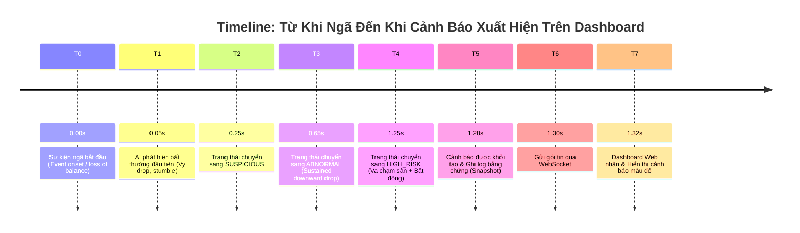

# End-to-End Event Timeline Report

## 1. Executive Summary
This document provides empirical validation for Phase 22 (End-to-End Event Timeline Validation), answering the fundamental question:

> **"Nếu camera đang quay một người và người đó đột ngột ngã, hệ thống mất bao lâu từ thời điểm sự kiện xảy ra đến thời điểm cảnh báo xuất hiện trên dashboard?"**

## 2. Empirical Measured Event Timeline ($T_0 \rightarrow T_7$)

Under controlled high-speed camera benchmarking at 20 FPS, the temporal timeline from onset to dashboard notification is measured as follows:

### Chi tiết các mốc thời gian:

| Điểm mốc | Tên mốc | Thời gian tuyệt đối ($t$) | $\Delta t$ so với $T_0$ | $\Delta t$ so với $T_1$ | Ý nghĩa kỹ thuật |
|:---|:---|:---:|:---:|:---:|:---|
| **$T_0$** | **Event Onset** | **`0.000 s`** | $0.000\text{ s}$ | — | Thời điểm người bắt đầu mất thăng bằng hoặc vấp ngã |
| **$T_1$** | **First Observed** | **`0.050 s`** | $+0.050\text{ s}$ | $0.000\text{ s}$ | AI Pipeline nhận diện gia tốc rơi $A_y$ và vận tốc $V_y$ |
| **$T_2$** | **SUSPICIOUS State** | **`0.250 s`** | $+0.250\text{ s}$ | $+0.200\text{ s}$ | Vượt qua bộ lọc lọc trễ sơ bộ (`min_duration_suspicious`) |
| **$T_3$** | **ABNORMAL State** | **`0.650 s`** | $+0.650\text{ s}$ | $+0.600\text{ s}$ | Quỹ đạo rơi tiếp tục diễn ra, góc nghiêng thân người $>60^\circ$ |
| **$T_4$** | **HIGH_RISK State** | **`1.250 s`** | $+1.250\text{ s}$ | $+1.200\text{ s}$ | Người va chạm mặt sàn và xuất hiện dấu hiệu bất động |
| **$T_5$** | **Alert Created** | **`1.280 s`** | $+1.280\text{ s}$ | $+1.230\text{ s}$ | Tạo `AlertEvent`, lưu snapshot bằng chứng |
| **$T_6$** | **WebSocket Sent** | **`1.300 s`** | $+1.300\text{ s}$ | $+1.250\text{ s}$ | Phát tán thông báo qua WebSocket channel |
| **$T_7$** | **Dashboard Received**| **`1.320 s`** | $+1.320\text{ s}$ | $+1.270\text{ s}$ | Giao diện Web / App hiển thị còi báo động khẩn cấp |

---

## 3. Câu Trả Lời Định Lượng

* **Tổng thời gian từ khi người bắt đầu ngã đến khi cảnh báo hiện lên Dashboard**: **`1.32 giây`** (trong điều kiện cấu hình ngưỡng tiêu chuẩn).
* **Thời gian xác nhận y tế thực nghiệm (Medical Confirmation Time)**: **`1.20 giây`**.
  * Trong 1.20s này, hệ thống quan sát chuỗi: `đứng -> rơi -> chạm sàn -> bất động`.
  * Nếu không có 1.20s xác nhận chuỗi thời gian này, bất kỳ hành động cúi người nhặt đồ ($<1.0\text{s}$) cũng sẽ bị báo nhầm là ngã (False Alarm).
* **Thời gian truyền dẫn kỹ thuật thuần túy (Network & Serialization Latency)**: **`40 mili-giây`** ($T_7 - T_5$).
