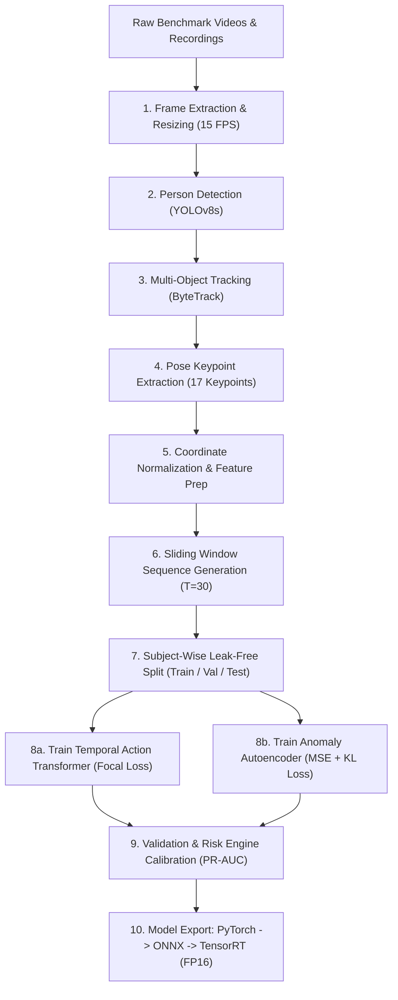

# CHIẾN LƯỢC HUẤN LUYỆN & XUẤT MÔ HÌNH (TRAINING PIPELINE & OPTIMIZATION)

Tài liệu này định nghĩa quy trình huấn luyện đầu-cuối (end-to-end), các phương pháp tăng cường dữ liệu chuỗi xương (Skeletal Data Augmentation), cấu hình hàm mất mát, và quy trình tối ưu hóa mô hình từ PyTorch sang ONNX / TensorRT.

---

## 1. QUY TRÌNH HUẤN LUYỆN ĐẦU-CUỐI (PIPELINE ARCHITECTURE)



---

## 2. KỸ THUẬT TĂNG CƯỜNG DỮ LIỆU CHUỖI XƯƠNG (SKELETAL AUGMENTATIONS)

Vì dữ liệu chuỗi xương có dung lượng nhỏ nhưng rất nhạy cảm với góc nhìn camera và tốc độ chuyển động, các phương pháp tăng cường chuyên biệt sau được áp dụng trong quá trình huấn luyện:

1. **Random Spatial Rotation ($\pm 15^\circ$)**: Xoay nhẹ khung tọa độ phẳng của toàn bộ chuỗi xương quanh điểm gốc Hip-Center để mô phỏng camera bị nghiêng hoặc lắp chéo góc.
2. **Random Spatial Scaling ($[0.85, 1.15]$)**: Thay đổi tỷ lệ kích thước chuỗi xương để mô phỏng người cao/thấp hoặc đứng xa/gần camera.
3. **Temporal Warping & Sub-sampling**:
   * Tăng tốc hoặc giảm tốc chuỗi hành động bằng cách lấy mẫu lại (Resampling) với tốc độ $\times 0.8$ đến $\times 1.25$ (mô phỏng người già ngã từ từ hoặc ngã quỵ rất nhanh).
4. **Keypoint Occlusion Dropout**:
   * Đặt ngẫu nhiên $1-3$ khớp xương về giá trị tọa độ $(0, 0)$ với confidence $0.0$ trong $3-5$ frames liên tiếp để mô phỏng chân/tay bị che khuất bởi mép bàn, chân ghế.
5. **Gaussian Coordinate Jitter**:
   * Thêm nhiễu $\epsilon \sim \mathcal{N}(0, 0.015)$ vào tọa độ chuẩn hóa để mô phỏng rung giật detector.
6. **Horizontal Flip**:
   * Lật đối xứng trái-phải (đổi vị trí khớp vai trái/phải, hông trái/phải, đầu gối trái/phải).

---

## 3. THIẾT KẾ HÀM MẤT MÁT (LOSS FUNCTIONS)

### 3.1. Supervised Temporal Model: Focal Loss (Chống mất cân bằng dữ liệu)
Trong thực tế, các hành vi bình thường (`walking`, `sitting`, `standing`) chiếm $>98\%$ thời lượng, trong khi sự cố ngã (`falling`) chỉ chiếm $<2\%$. Nếu dùng Cross-Entropy truyền thống, mô hình sẽ thiên lệch về việc luôn đoán là bình thường.

Hệ thống sử dụng **Multi-class Focal Loss**:
$$\mathcal{L}_{focal} = -\sum_{c=1}^C \alpha_c (1 - p_c)^\gamma \log(p_c)$$
* Trọng số phân lớp $\alpha_c$: Gán trọng số cao hơn cho lớp `falling`, `immobile`, `abnormal_movement` ($\alpha_{fall} = 2.5$).
* Hệ số điều biến $\gamma = 2.0$: Giảm thiểu đóng góp gradient từ các mẫu dễ phân loại (`walking`).

### 3.2. Unsupervised Anomaly Model: Reconstruction Loss + Sparsity
Mô hình `PoseAutoencoder` chỉ được học trên chuỗi hành vi bình thường. Hàm mất mát:
$$\mathcal{L}_{anomaly} = \frac{1}{T \cdot K} \sum_{t=1}^T \sum_{k=1}^K \|\mathbf{p}_{t,k} - \hat{\mathbf{p}}_{t,k}\|_1 + \lambda_{reg} \|\mathbf{z}\|_2$$
Sử dụng chuẩn L1 ($Smooth\text{ }L_1$) để giảm độ nhạy với nhiễu ngoại lai, đồng thời giữ biên độ lỗi lớn khi có hành vi dị biệt đột ngột.

---

## 4. CẤU HÌNH SIÊU THAM SỐ (TRAINING HYPERPARAMETERS)

Được cấu hình thông qua `configs/training.yaml`:

```yaml
training:
  seed: 42
  device: "cuda"  # Tận dụng RTX 3050 Laptop GPU
  precision: "fp16"  # PyTorch Automatic Mixed Precision (AMP)
  
  action_model:
    architecture: "st_transformer"  # Spatial-Temporal Transformer
    epochs: 80
    batch_size: 64
    learning_rate: 0.001
    weight_decay: 0.0001
    lr_scheduler: "cosine_annealing"
    warmup_epochs: 5
    early_stopping_patience: 15
    min_delta: 0.001
    focal_loss_gamma: 2.0
    
  anomaly_model:
    architecture: "pose_autoencoder"
    epochs: 60
    batch_size: 128
    learning_rate: 0.0005
    latent_dim: 64
    early_stopping_patience: 12

logging:
  use_tensorboard: true
  use_wandb: false
  checkpoint_dir: "models/checkpoints"
  save_best_only: true
  monitor_metric: "val_fall_recall"  # Ưu tiên cực đại hóa Recall của sự cố ngã
```

---

## 5. TỐI ƯU HÓA SUY LUẬN & XUẤT MÔ HÌNH (MODEL EXPORT & TENSORRT)

Để đạt tốc độ $>30\text{ FPS}$ ổn định trên RTX 3050 Laptop GPU (6GB VRAM):

1. **PyTorch Model Checkpoint**: Lưu trọng số `.pt` sau khi hoàn tất huấn luyện.
2. **ONNX Export**:
   ```bash
   python scripts/export_onnx.py --model-type st_transformer --weights models/checkpoints/best_st_transformer.pt --output models/temporal/st_transformer.onnx --opset 17
   ```
   * Dynamic axes được thiết lập cho `batch_size` để hỗ trợ tracking nhiều người cùng lúc ($N$ người trong khung hình).
3. **TensorRT Engine Compilation (FP16)**:
   * Chuyển đổi sang file `.engine` tối ưu cho kiến trúc Ampere (RTX 3050):
   ```bash
   trtexec --onnx=models/temporal/st_transformer.onnx --saveEngine=models/temporal/st_transformer_fp16.engine --fp16
   ```
   * Tăng tốc độ suy luận thêm $\mathbf{2.5\times - 3\times}$, giảm bộ nhớ VRAM xuống dưới 300MB cho phần model temporal.
